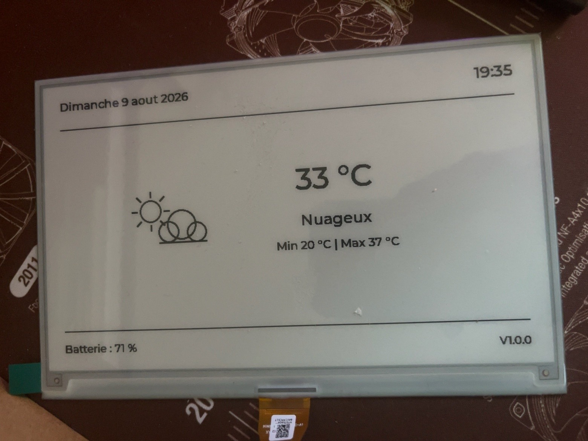
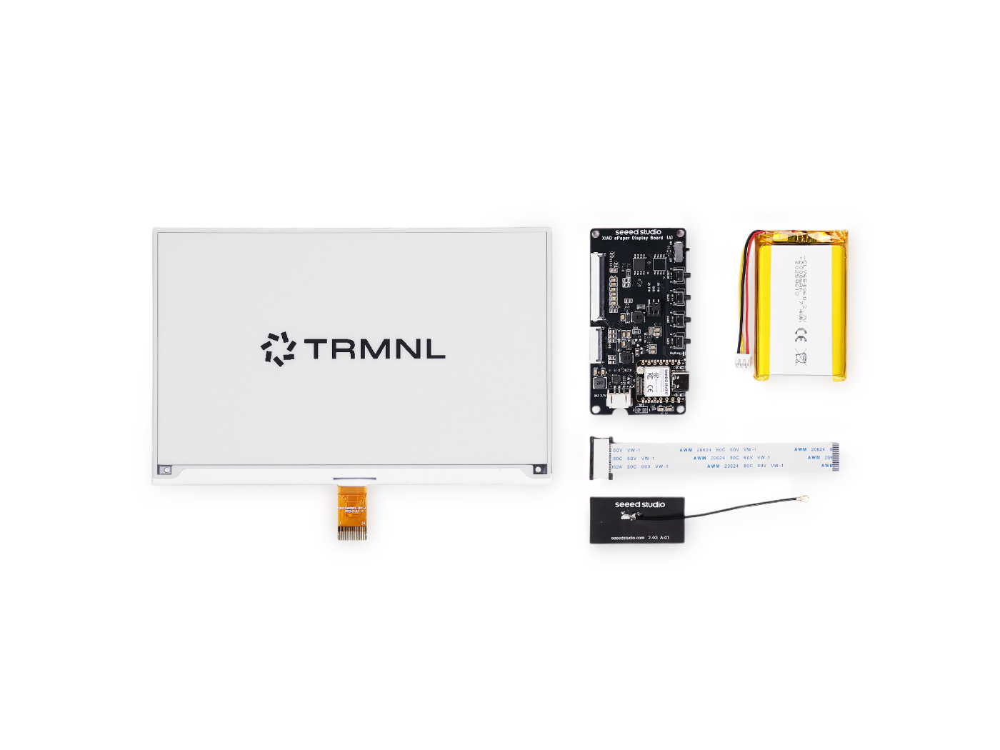
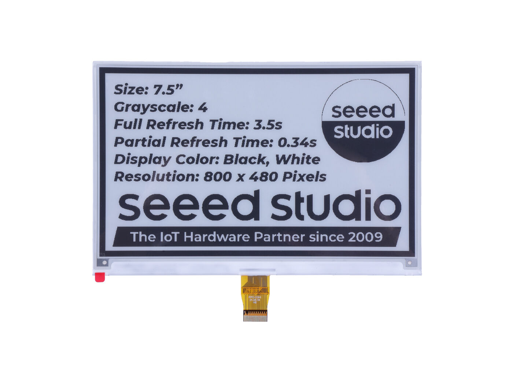
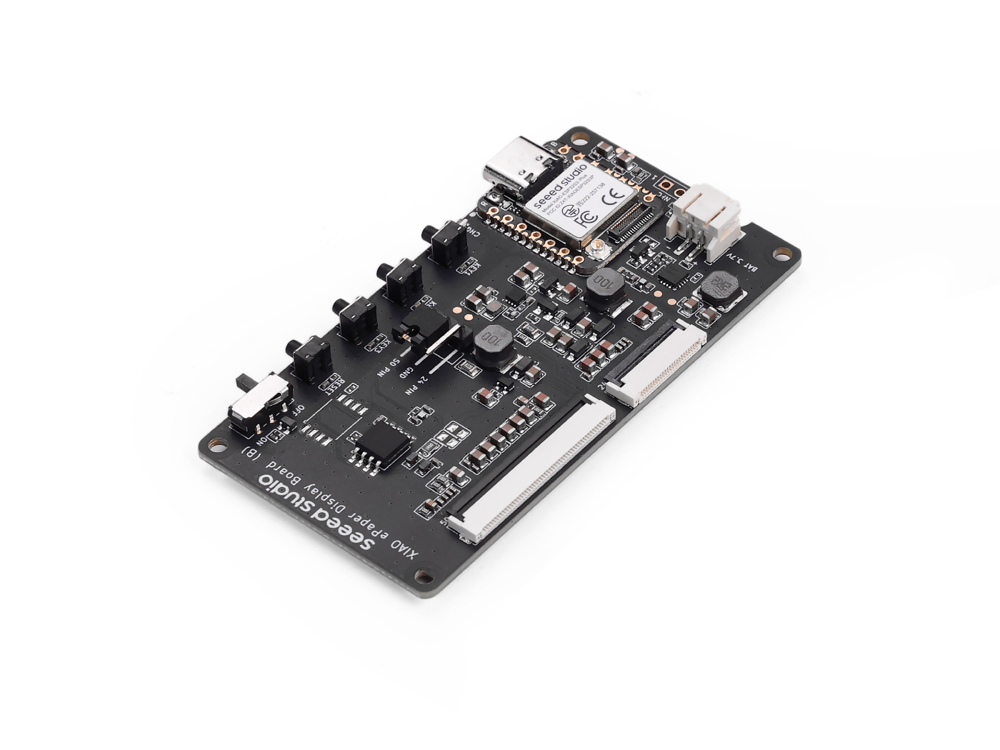
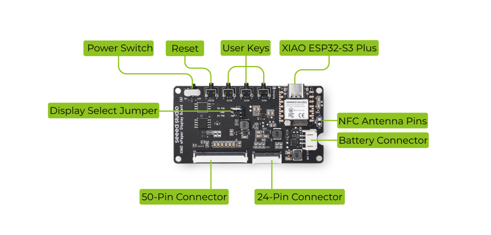
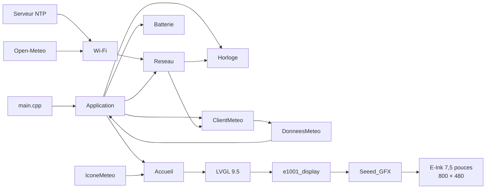
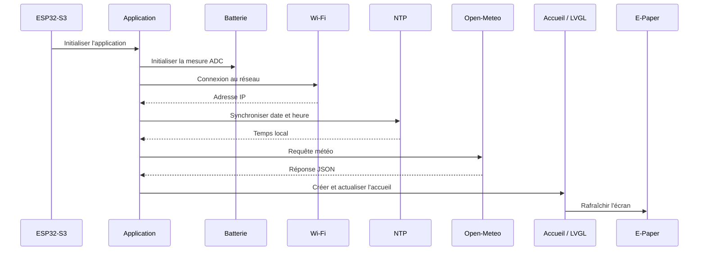

<div align="center">
  
# E-Ink Display

### Dashboard E-Ink 7,5" autonome sur TRMNL DIY Kit / XIAO ESP32-S3 Plus

Firmware **C++ / PlatformIO** entièrement personnalisé pour transformer le
[TRMNL 7.5" (OG) DIY Kit](https://wiki.seeedstudio.com/trmnl_7inch5_diy_kit_main_page/)
en tableau de bord E-Ink de bureau : heure, date, météo, batterie et futures pages interactives.

[](https://github.com/ThomasHni/E-Ink-Display/actions/workflows/build.yml)
[](https://github.com/ThomasHni/E-Ink-Display/actions/workflows/clang-format.yml)
[](#roadmap)
[](https://en.cppreference.com/)
[](https://platformio.org/)
[](https://docs.espressif.com/projects/arduino-esp32/)
[](https://docs.lvgl.io/)
[](https://wiki.seeedstudio.com/epaper_ee04/)
[](https://wiki.seeedstudio.com/trmnl_7inch5_diy_kit_main_page/)
[](https://open-meteo.com/en/docs)
[](https://clang.llvm.org/docs/ClangFormat.html)

**[Démarrage rapide](#démarrage-rapide)** ·
**[Matériel](#matériel)** ·
**[Architecture](#architecture-logicielle)** ·
**[Brochage](#brochage-utile)** ·
**[Roadmap](#roadmap)**

</div>

---

## Aperçu

<p align="center">
  
</p>

La **V1.1.0** affiche une page d'accueil monochrome optimisée pour l'E-Ink avec :

- la **date** et l'**heure locale** synchronisées par NTP ;
- la **météo actuelle** récupérée depuis [Open-Meteo](https://open-meteo.com/en/docs) ;
- la température actuelle et les **minimum / maximum journaliers** ;
- une condition météo traduite en français à partir des codes WMO ;
- des **pictogrammes météo dessinés directement avec LVGL** ;
- des **variantes jour / nuit** des pictogrammes grâce à l'indicateur `is_day` d'Open-Meteo ;
- une estimation du **niveau de batterie** à partir de l'ADC de l'EE04 ;
- la version du firmware ;
- une architecture C++ modulaire préparée pour les futures pages.

> [!NOTE]
> Depuis la V1.1.0, les données météo sont actualisées périodiquement afin de maintenir les informations et les pictogrammes jour / nuit à jour. L'optimisation du rafraîchissement E-Ink et le deep sleep restent prévus pour une version ultérieure.

---

## Sommaire
- [E-Ink Display](#e-ink-display)
    - [Dashboard E-Ink 7,5" autonome sur TRMNL DIY Kit / XIAO ESP32-S3 Plus](#dashboard-e-ink-75-autonome-sur-trmnl-diy-kit--xiao-esp32-s3-plus)
  - [Aperçu](#aperçu)
  - [Sommaire](#sommaire)
  - [Objectif](#objectif)
    - [Principes de conception](#principes-de-conception)
  - [Fonctionnalités](#fonctionnalités)
    - [V1.0.0](#v100)
    - [V1.1.0](#v110)
    - [Limites actuelles](#limites-actuelles)
  - [Démarrage rapide](#démarrage-rapide)
    - [Prérequis](#prérequis)
    - [1. Cloner le dépôt](#1-cloner-le-dépôt)
    - [2. Créer le fichier de secrets](#2-créer-le-fichier-de-secrets)
    - [3. Configurer la localisation météo](#3-configurer-la-localisation-météo)
    - [4. Compiler puis téléverser](#4-compiler-puis-téléverser)
  - [Matériel](#matériel)
    - [Vue d’ensemble du kit](#vue-densemble-du-kit)
    - [TRMNL 7.5" (OG) DIY Kit](#trmnl-75-og-diy-kit)
    - [Écran E-Ink 7,5"](#écran-e-ink-75)
    - [XIAO ePaper Display Board EE04](#xiao-epaper-display-board-ee04)
    - [Repérage visuel de la carte EE04](#repérage-visuel-de-la-carte-ee04)
    - [Résumé matériel utilisé dans ce dépôt](#résumé-matériel-utilisé-dans-ce-dépôt)
    - [Références matérielles](#références-matérielles)
    - [Configuration `driver.h`](#configuration-driverh)
  - [Brochage utile](#brochage-utile)
  - [Architecture logicielle](#architecture-logicielle)
    - [Responsabilités](#responsabilités)
  - [Organisation du dépôt](#organisation-du-dépôt)
  - [Environnement logiciel](#environnement-logiciel)
    - [`platformio.ini`](#platformioini)
    - [Dépendances principales](#dépendances-principales)
  - [Configuration](#configuration)
    - [Paramètres généraux](#paramètres-généraux)
    - [Configuration du Wi-Fi](#configuration-du-wi-fi)
  - [Compiler, téléverser et monitorer](#compiler-téléverser-et-monitorer)
    - [Depuis VS Code](#depuis-vs-code)
    - [Depuis le terminal](#depuis-le-terminal)
  - [Fonctionnement interne](#fonctionnement-interne)
    - [Séquence de démarrage](#séquence-de-démarrage)
    - [Données météo](#données-météo)
    - [Boucle principale](#boucle-principale)
  - [Qualité du code et CI](#qualité-du-code-et-ci)
    - [Conventions de développement](#conventions-de-développement)
    - [clang-format](#clang-format)
    - [GitHub Actions](#github-actions)
  - [Roadmap](#roadmap)
    - [v1.0.0 — Dashboard principal](#v100--dashboard-principal)
    - [v1.1.0 — Gestion jour / nuit + préparation V2](#v110--gestion-jour--nuit--préparation-v2)
    - [v2 — Navigation et nouvelles pages](#v2--navigation-et-nouvelles-pages)
  - [Dépannage](#dépannage)
  - [Sécurité](#sécurité)
  - [Contribution](#contribution)
  - [Licence](#licence)
  - [Documentation utile](#documentation-utile)

---

## Objectif

**E-Ink Dashboard** utilise le [TRMNL 7.5" (OG) DIY Kit](https://wiki.seeedstudio.com/trmnl_7inch5_diy_kit_main_page/)
comme **base matérielle uniquement**. Le firmware, l'interface, les services réseau et la logique applicative sont développés indépendamment de l'écosystème logiciel TRMNL.

L'objectif est de construire progressivement un tableau de bord de bureau :

```text
Internet
   │
   ├── NTP
   └── Open-Meteo
          │
          ▼
     Wi-Fi 2,4 GHz
          │
          ▼
   XIAO ESP32-S3 Plus
          │
          ├── logique C++
          ├── LVGL 9.5
          └── Seeed_GFX
                    │
                    ▼
             E-Ink 7,5"
              800 × 480
```

### Principes de conception

| Principe | Application dans le projet |
| :--- | :--- |
| **Indépendance** | aucun serveur TRMNL requis pour générer l'interface |
| **Modularité** | classes séparées par responsabilité avec fichiers `.h` / `.cpp` |
| **Lisibilité** | code et nommage en français, fonctions courtes, constantes nommées |
| **E-Ink first** | interface monochrome et limitation des rafraîchissements inutiles |
| **Reproductibilité** | dépendances déclarées dans [`platformio.ini`](platformio.ini) |
| **Sécurité** | identifiants Wi-Fi exclus de Git via [`Secrets.h`](#configuration-du-wi-fi) |
| **Évolutivité** | système préparé pour météo détaillée, calendrier et monitoring PC |

---

## Fonctionnalités

### V1.0.0

| Fonction | État | Implémentation |
| :--- | :---: | :--- |
| Date locale | [x] | horloge système ESP32 + fuseau Europe/Paris |
| Heure locale | [x] | synchronisation NTP au démarrage |
| Connexion Wi-Fi | [x] | framework Arduino ESP32 |
| Température actuelle | [x] | [Open-Meteo Forecast API](https://open-meteo.com/en/docs) |
| Conditions météo | [x] | codes météo WMO |
| Min / Max journalier | [x] | `temperature_2m_min` / `temperature_2m_max` |
| Icônes météo | [x] | Canvas LVGL monochrome |
| Niveau de batterie | [x] | ADC de la carte EE04 |
| Version firmware | [x] | affichage `v1.0.0` |
| Mise à jour de l'heure | [x] | détection du changement de minute |
| Interface E-Ink | [x] | LVGL + `e1001_display` + Seeed_GFX |

### V1.1.0

| Fonction | État | Implémentation |
| :--- | :---: | :--- |
| Détection jour / nuit | [x] | `is_day` via Open-Meteo |
| Icône ciel dégagé de jour | [x] | soleil dessiné avec LVGL |
| Icône ciel dégagé de nuit | [x] | lune dessinée avec LVGL |
| Variantes météo jour / nuit | [x] | `IconeMeteo` selon le code WMO et `is_day` |
| Version firmware | [x] | affichage `v1.1.0` |
| Actualisation périodique de la météo | [x] | récupération automatique à intervalle régulier |
| Orchestration applicative | [x] | classe `Application` dédiée |

### Limites actuelles

- le pourcentage de batterie reste une estimation basée sur la tension ;
- une seule page est disponible ;
- les trois boutons utilisateur ne pilotent pas encore la navigation ;
- le deep sleep n'est pas encore exploité ;
- le rafraîchissement E-Ink est encore déclenché à chaque changement de minute.

---

## Démarrage rapide

### Prérequis

Avant de commencer, installer :

- [Visual Studio Code](https://code.visualstudio.com/) ;
- l'extension [PlatformIO IDE](https://platformio.org/install/ide?install=vscode) ;
- [Git](https://git-scm.com/) ;
- un câble USB-C **compatible données**.

Côté matériel, le projet cible le [TRMNL 7.5" (OG) DIY Kit](https://wiki.seeedstudio.com/trmnl_7inch5_diy_kit_main_page/)
équipé de la [XIAO ePaper Display Board EE04](https://wiki.seeedstudio.com/epaper_ee04/).

### 1. Cloner le dépôt

```bash
git clone https://github.com/ThomasHni/E-Ink-Display.git
cd E-Ink-Display
```

### 2. Créer le fichier de secrets

<details>
<summary><strong>Windows PowerShell</strong></summary>

```powershell
Copy-Item include/Secrets.exemple.h include/Secrets.h
```

</details>

<details>
<summary><strong>Linux / macOS</strong></summary>

```bash
cp include/Secrets.exemple.h include/Secrets.h
```

</details>

Copier le modèle [`include/Secrets.exemple.h`](include/Secrets.exemple.h), puis renseigner le réseau Wi-Fi dans le fichier local `include/Secrets.h` :

```cpp
#ifndef SECRETS_H
#define SECRETS_H

constexpr char NOM_RESEAU_WIFI[]    = "MonWifi";
constexpr char MOT_DE_PASSE_WIFI[]  = "MonMotDePasse";

#endif // SECRETS_H
```

### 3. Configurer la localisation météo

Modifier les coordonnées dans [`include/Configuration.h`](include/Configuration.h) :

```cpp
constexpr float LATITUDE_METEO  = 43.9493F;
constexpr float LONGITUDE_METEO = 4.8055F;
```

[Open-Meteo](https://open-meteo.com/en/docs) utilise des coordonnées latitude / longitude pour sélectionner le point de prévision.

### 4. Compiler puis téléverser

```bash
pio run -e trmnl_diy_kit
pio run -e trmnl_diy_kit -t upload
```

Puis ouvrir le moniteur série :

```bash
pio device monitor -b 115200
```

> [!TIP]
> PlatformIO installe automatiquement les dépendances déclarées dans [`lib_deps`](https://docs.platformio.org/en/latest/projectconf/sections/env/options/library/lib_deps.html) lors du traitement du projet.

---

## Matériel

Le projet repose sur le **[TRMNL 7.5" (OG) DIY Kit](https://wiki.seeedstudio.com/trmnl_7inch5_diy_kit_main_page/)**, utilisé ici comme **base matérielle uniquement**.  
Le firmware de ce dépôt est développé indépendamment de l’écosystème logiciel TRMNL.

---

### Vue d’ensemble du kit

<p align="center">
  
</p>

### TRMNL 7.5" (OG) DIY Kit

Le kit officiel **Seeed Studio / TRMNL** fournit l’ensemble de la plateforme matérielle utilisée par le projet : un écran E-Ink 7,5", une carte basée sur le **XIAO ESP32-S3 Plus**, une batterie Li-ion rechargeable et les accessoires de connexion nécessaires.

| Élément | Spécification |
| :--- | :--- |
| Microcontrôleur | **XIAO ESP32-S3 Plus** |
| Carte écran | **XIAO ePaper Display Board EE04** |
| Écran | E-Paper monochrome **7,5"** |
| Résolution | **800 × 480 px** |
| Rafraîchissement annoncé | partiel **~0,34 s** / complet **~3,5 s** |
| Batterie | Li-ion rechargeable **2000 mAh** |
| Alimentation kit | **5 V** |
| Câble écran | extension FPC **10 cm** |
| Température de fonctionnement annoncée | **-40 °C à 85 °C** |
| Boîtier | non inclus dans le kit DIY |

> [!IMPORTANT]
> L’autonomie annoncée par Seeed, pouvant atteindre environ **3 mois**, correspond à un scénario de **deep sleep** avec un rafraîchissement très espacé, typiquement toutes les 6 heures. Ce n’est pas le profil énergétique de la V1 actuelle.

---

### Écran E-Ink 7,5"

<p align="center">
  
</p>

Cet écran est un **E-Paper monochrome 7,5 pouces** affichant en **800 × 480 pixels**.  
Il est particulièrement adapté à un dashboard statique basse consommation grâce à son bon niveau de lisibilité et à sa capacité de rafraîchissement partiel.

| Caractéristique | Valeur |
| :--- | :--- |
| Taille | **7,5 pouces** |
| Type | E-Paper monochrome |
| Résolution | **800 × 480 px** |
| Couleurs | noir / blanc |
| Niveaux de gris | **4** |
| Temps de rafraîchissement partiel | **~0,34 s** |
| Temps de rafraîchissement complet | **~3,5 s** |

---

### XIAO ePaper Display Board EE04

<p align="center">
  
</p>

La **[XIAO ePaper Display Board EE04](https://wiki.seeedstudio.com/epaper_ee04/)** est la carte principale du projet.  
Elle embarque le **XIAO ESP32-S3 Plus** et fournit les connecteurs ainsi que les fonctions d’alimentation nécessaires à l’écran E-Paper.

| Élément | Caractéristique |
| :--- | :--- |
| Processeur embarqué | **XIAO ESP32-S3 Plus** |
| Connecteur E-Paper principal | **FPC 24 broches, pas 0,5 mm** |
| Connecteur E-Paper secondaire | **FPC 50 broches, pas 0,5 mm** |
| Connecteur batterie | **JST 2,0 mm** |
| Charge | circuit de charge intégré |
| Interrupteur | alimentation batterie **ON/OFF** |
| Boutons | **1 Reset + 3 boutons utilisateur** |
| Alimentation | batterie Li-ion **3,7 V** / **USB Type-C** |

---

### Repérage visuel de la carte EE04

<p align="center">
  
</p>

Cette vue annotée permet de repérer rapidement :

- le **Power Switch** ;
- le **Reset** ;
- les **User Keys** ;
- le **XIAO ESP32-S3 Plus** ;
- le **Battery Connector** ;
- le **24-Pin Connector** ;
- le **50-Pin Connector** ;
- le **Display Select Jumper**.

> [!WARNING]
> Pour l’écran monochrome **7,5" 800 × 480** utilisé dans ce projet, le **jumper doit être configuré sur 24 Pin**.  
> Une sélection incorrecte peut empêcher l’affichage ou produire un comportement anormal.

---

### Résumé matériel utilisé dans ce dépôt

| Module | Utilisé dans ce projet | Rôle |
| :--- | :---: | :--- |
| TRMNL 7.5" E-Ink Display | Oui | affichage principal |
| XIAO ESP32-S3 Plus | Oui | microcontrôleur principal |
| EE04 | Oui | carte d’interface et d’alimentation |
| Batterie 2000 mAh | Oui | alimentation portable |
| Boutons utilisateur | Partiellement | réservés pour les futures pages / navigation |
| Connecteur 50 broches | Non | non utilisé avec cet écran |
| NFC | Non | non exploité dans la V1 |

---

### Références matérielles

- [TRMNL 7.5" (OG) DIY Kit — documentation officielle](https://wiki.seeedstudio.com/trmnl_7inch5_diy_kit_main_page/)
- [XIAO ePaper Display Board EE04 — documentation officielle](https://wiki.seeedstudio.com/epaper_ee04/)
- [EE04 avec PlatformIO — guide officiel](https://wiki.seeedstudio.com/ee04_with_platformio/)
- [XIAO 7.5" ePaper Panel — documentation officielle](https://wiki.seeedstudio.com/xiao_075inch_epaper_panel/)

### Configuration `driver.h`

Le projet conserve [`lib/driver/driver.h`](lib/driver/driver.h), généré selon le flux
[Seeed_GFX / EE04 documenté par Seeed](https://wiki.seeedstudio.com/ee04_with_platformio/).
Pour la combinaison EE04 + écran monochrome 7,5" du tutoriel, Seeed indique :

```cpp
#define BOARD_SCREEN_COMBO 502
#define USE_XIAO_EPAPER_DISPLAY_BOARD_EE04
```

> [!WARNING]
> Un mauvais `BOARD_SCREEN_COMBO` peut conduire à un écran entièrement blanc ou à un rendu incorrect.

---

## Brochage utile

Les signaux bas niveau de l'écran sont encapsulés par `driver.h`, `e1001_display` et [Seeed_GFX](https://github.com/Seeed-Studio/Seeed_GFX). Les E/S directement utiles à l'application sont :

| Fonction | Alias XIAO | GPIO ESP32-S3 | Mode | État actif | V1 |
| :--- | :--- | :---: | :--- | :---: | :---: |
| Mesure batterie | `A0` | **GPIO1** | ADC | analogique | [x] |
| Activation ADC batterie | `D5 / A5` | **GPIO6** | sortie | `HIGH` | [x] |
| Bouton KEY1 | `D1 / A1` | **GPIO2** | entrée | `LOW` | ⏳ |
| Bouton KEY2 | `D2 / A2` | **GPIO3** | entrée | `LOW` | ⏳ |
| Bouton KEY3 | `D4 / A4` | **GPIO5** | entrée | `LOW` | ⏳ |
| USB-C | — | USB | alimentation / série / flash | — | [x] |

Les boutons sont **actifs à l'état bas** : `LOW` lorsqu'ils sont pressés, `HIGH` lorsqu'ils sont relâchés.

<details>
<summary><strong>Mesure de la batterie</strong></summary>

La [recette PlatformIO EE04](https://wiki.seeedstudio.com/ee04_with_platformio/) utilise :

- un ADC 12 bits ;
- `A0 / GPIO1` pour la mesure ;
- `GPIO6` pour activer le circuit de mesure ;
- plusieurs échantillons moyennés ;
- un diviseur de tension de rapport 2.

Le projet encapsule cette logique dans la classe [`Batterie`](lib/batterie/Batterie.h).

</details>

---

## Architecture logicielle

Le firmware sépare la logique métier, les services réseau, l'interface LVGL et la couche matérielle.



### Responsabilités

| Module | Responsabilité |
| :--- | :--- |
| [`Accueil`](lib/accueil/Accueil.h) | construction, disposition et actualisation de la page principale |
| [`Batterie`](lib/batterie/Batterie.h) | acquisition ADC et estimation du niveau de batterie |
| [`Horloge`](lib/horloge/Horloge.h) | synchronisation, lecture et formatage date / heure |
| [`Reseau`](lib/reseau/Reseau.h) | connexion Wi-Fi |
| [`ClientMeteo`](lib/meteo/ClientMeteo.h) | requête HTTP et désérialisation JSON |
| [`DonneesMeteo`](lib/meteo/DonneesMeteo.h) | structure de transport des données météo |
| [`IconeMeteo`](lib/meteo/IconeMeteo.h) | conversion WMO et dessin des pictogrammes |
| [`e1001_display`](lib/e1001_display/e1001_display.h) | adaptation entre LVGL et le matériel E-Paper |
| [`driver.h`](lib/driver/driver.h) | sélection de la combinaison carte / écran Seeed |
| [`lv_conf.h`](lib/lvgl_conf/lv_conf.h) | configuration LVGL et polices intégrées |
| [`Application`](lib/application/Application.h) | orchestration générale du firmware, initialisation et actualisations périodiques |

---

## Organisation du dépôt

```text
E-Ink-Display/
├── .github/
│   └── workflows/
│       ├── build.yml
│       └── clang-format.yml
├── docs/
│   └── images/
│       └── Display-v1.jpg
├── include/
│   ├── Configuration.h
│   ├── Secrets.exemple.h
│   └── Secrets.h              # local uniquement, ignoré par Git
├── lib/
│   ├── application/
│   │   ├── Application.cpp
│   │   └── Application.h
│   ├── accueil/
│   │   ├── Accueil.cpp
│   │   └── Accueil.h
│   ├── batterie/
│   │   ├── Batterie.cpp
│   │   └── Batterie.h
│   ├── driver/
│   │   └── driver.h
│   ├── e1001_display/
│   │   ├── e1001_display.cpp
│   │   └── e1001_display.h
│   ├── horloge/
│   │   ├── Horloge.cpp
│   │   └── Horloge.h
│   ├── lvgl_conf/
│   │   └── lv_conf.h
│   ├── meteo/
│   │   ├── ClientMeteo.cpp
│   │   ├── ClientMeteo.h
│   │   ├── DonneesMeteo.h
│   │   ├── IconeMeteo.cpp
│   │   └── IconeMeteo.h
│   └── reseau/
│       ├── Reseau.cpp
│       └── Reseau.h
├── src/
│   └── main.cpp
├── .clang-format
├── .gitignore
├── platformio.ini
└── README.md
```

Les bibliothèques tierces ne sont pas copiées dans `lib/` : elles sont déclarées dans [`platformio.ini`](platformio.ini) et gérées par PlatformIO.

---

## Environnement logiciel

Le projet est compilé avec [PlatformIO](https://docs.platformio.org/) et le framework Arduino pour ESP32.

### `platformio.ini`

```ini
[env:trmnl_diy_kit]
platform = https://github.com/Seeed-Studio/platform-seeedboards.git
board = seeed-xiao-esp32-s3-sense
framework = arduino

upload_speed = 115200
monitor_speed = 115200

board_build.arduino.memory_type = qio_opi

build_flags =
    -D BOARD_HAS_PSRAM
    -I include
    -I src

lib_deps =
    https://github.com/Seeed-Studio/Seeed_GFX
    lvgl/lvgl@^9.5.0
    bblanchon/ArduinoJson
```

### Dépendances principales

| Technologie | Usage | Documentation |
| :--- | :--- | :--- |
| PlatformIO | build, upload, dépendances | [Documentation](https://docs.platformio.org/) |
| Arduino ESP32 | Wi-Fi, HTTP, NTP, ADC | [Arduino-ESP32](https://docs.espressif.com/projects/arduino-esp32/) |
| Seeed_GFX | pilotage E-Paper | [GitHub](https://github.com/Seeed-Studio/Seeed_GFX) |
| LVGL 9.5 | interface et Canvas météo | [Documentation](https://docs.lvgl.io/) |
| ArduinoJson | parsing des réponses météo | [Documentation](https://arduinojson.org/) |
| Open-Meteo | données météo | [Forecast API](https://open-meteo.com/en/docs) |

> [!NOTE]
> L'identifiant PlatformIO `seeed-xiao-esp32-s3-sense` fait partie de la configuration actuelle fonctionnelle du projet. Le matériel du kit repose bien sur un **XIAO ESP32-S3 Plus**.

---

## Configuration

### Paramètres généraux

Les paramètres versionnés se trouvent dans [`include/Configuration.h`](include/Configuration.h). Ils regroupent notamment :

- les temporisations ;
- les serveurs NTP ;
- le fuseau horaire ;
- l'URL Open-Meteo ;
- les coordonnées de la localisation ;
- la version du firmware.

Exemple :

```cpp
constexpr char VERSION_APPLICATION[] = "v1.1.0";
constexpr float LATITUDE_METEO        = 43.9493F;
constexpr float LONGITUDE_METEO       = 4.8055F;
```

### Configuration du Wi-Fi

Les identifiants sont séparés du code versionné.

Le dépôt contient uniquement [`include/Secrets.exemple.h`](include/Secrets.exemple.h). Le développeur crée localement `include/Secrets.h`, ignoré grâce à [`.gitignore`](.gitignore).

```cpp
constexpr char NOM_RESEAU_WIFI[]   = "MonWifi";
constexpr char MOT_DE_PASSE_WIFI[] = "MonMotDePasse";
```

> [!CAUTION]
> Ne jamais commiter `Secrets.h`. Si un identifiant a déjà été publié dans l'historique Git, l'ajouter ensuite au `.gitignore` ne suffit pas : le secret doit être retiré de l'historique et remplacé côté réseau ou service.

---

## Compiler, téléverser et monitorer

### Depuis VS Code

Avec [PlatformIO IDE](https://platformio.org/install/ide?install=vscode) :

1. brancher le XIAO en USB-C ;
2. lancer **Build** ;
3. lancer **Upload** ;
4. ouvrir **Serial Monitor** à `115200 bauds`.

### Depuis le terminal

Compiler l'environnement `trmnl_diy_kit` :

```bash
pio run -e trmnl_diy_kit
```

Téléverser le firmware :

```bash
pio run -e trmnl_diy_kit -t upload
```

Ouvrir le moniteur série :

```bash
pio device monitor -b 115200
```

Nettoyer les fichiers de build :

```bash
pio run -t clean
```

La commande [`pio run`](https://docs.platformio.org/en/latest/core/userguide/cmd_run.html) utilise directement l'environnement défini dans `platformio.ini`.

---

## Fonctionnement interne

### Séquence de démarrage



### Données météo

Le client demande à [Open-Meteo](https://open-meteo.com/en/docs) uniquement les données nécessaires au dashboard :

```text
current
├── temperature_2m
├── weather_code
└── is_day

daily
├── temperature_2m_min
└── temperature_2m_max
```

Le `weather_code` est un **code WMO**. [`ClientMeteo`](lib/meteo/ClientMeteo.h) le traduit en condition française, tandis que [`IconeMeteo`](lib/meteo/IconeMeteo.h) sélectionne le pictogramme monochrome correspondant.

### Boucle principale

Le [`main.cpp`](src/main.cpp) reste volontairement réduit à l'orchestration :

```cpp
void loop()
{
    application.executer();
}
```

Depuis la V1.1.0, `main.cpp` délègue l'orchestration à la classe `Application`. Cette séparation prépare l'arrivée de la navigation et des futures pages de la V2.

---

## Qualité du code et CI

### Conventions de développement

Le code applicatif suit les bonnes pratiques du
[guide de programmation BTS SN de TVaira](http://tvaira.free.fr/projets/activites/guide-programmation-btssn/guide-programmation-btssn.html)
et les règles propres au projet :

- code applicatif en **français** ;
- programmation orientée objet ;
- séparation `.h` / `.cpp` ;
- une responsabilité principale par classe ;
- fonctions courtes et nommées avec un verbe ;
- `setup()` et `loop()` limités à l'orchestration ;
- constantes nommées pour les paramètres, seuils et dimensions significatives ;
- limitation des valeurs magiques ;
- identifiants sensibles séparés du code ;
- formatage homogène via [clang-format](https://clang.llvm.org/docs/ClangFormat.html).

### clang-format

Le fichier [`.clang-format`](.clang-format) est basé sur le style **Mozilla** avec notamment :

```yaml
BasedOnStyle: Mozilla
Language: Cpp
Standard: c++17
BreakBeforeBraces: Allman
IndentWidth: 4
TabWidth: 4
UseTab: Never
ColumnLimit: 100
```

Le détail complet reste dans le fichier `.clang-format`, afin d'éviter de dupliquer toute la configuration dans cette documentation. Le champ `Standard: c++17` indique à clang-format comment analyser la syntaxe C++ ; le standard réellement utilisé à la compilation reste déterminé par la toolchain et les options de [`platformio.ini`](platformio.ini).

### GitHub Actions

Le dépôt peut utiliser deux workflows complémentaires :

| Workflow | Fichier | Objectif |
| :--- | :--- | :--- |
| PlatformIO CI | [`.github/workflows/build.yml`](.github/workflows/build.yml) | vérifier que le firmware compile |
| clang-format | [`.github/workflows/clang-format.yml`](.github/workflows/clang-format.yml) | vérifier le formatage C/C++ |

Pour un projet PlatformIO natif, la [documentation PlatformIO sur GitHub Actions](https://docs.platformio.org/en/latest/integration/ci/github-actions.html) recommande l'utilisation de `pio run` dans la CI.

> [!IMPORTANT]
> Le workflow de compilation doit générer un `Secrets.h` factice à partir de `Secrets.exemple.h`. Les vrais identifiants Wi-Fi ne sont jamais nécessaires pour compiler le firmware.

---

## Roadmap

### v1.0.0 — Dashboard principal

- [x] PlatformIO / ESP32-S3
- [x] E-Ink 7,5" 800×480
- [x] LVGL 9.5
- [x] Wi-Fi
- [x] NTP
- [x] date et heure
- [x] mesure batterie
- [x] météo Open-Meteo
- [x] température actuelle
- [x] minimum / maximum journalier
- [x] conditions météo
- [x] pictogrammes météo personnalisés
- [x] interface principale moderne
- [x] version firmware

### v1.1.0 — Gestion jour / nuit + préparation V2

- [x] récupération de `is_day` depuis Open-Meteo ;
- [x] distinction jour / nuit ;
- [x] pictogramme soleil en journée ;
- [x] pictogramme lune pendant la nuit ;
- [x] variantes météo adaptées au cycle jour / nuit.
- [x] création de `Application` pour centraliser l'orchestration ;
- [x] allègement de `main.cpp` ;
- [x] actualisation périodique de la météo ;

### v2 — Navigation et nouvelles pages

- WIP

---

## Dépannage

<details>
<summary><strong>L'écran reste blanc</strong></summary>

Vérifier dans cet ordre :

1. le câble FPC et son verrouillage ;
2. l'orientation du câble — Seeed indique que la face métallique doit être orientée correctement ;
3. le jumper EE04 en position **24 Pin** ;
4. [`lib/driver/driver.h`](lib/driver/driver.h) ;
5. la présence de Seeed_GFX dans [`platformio.ini`](platformio.ini) ;
6. les erreurs affichées dans le moniteur série.

Consulter si nécessaire le [guide PlatformIO EE04](https://wiki.seeedstudio.com/ee04_with_platformio/).

</details>

<details>
<summary><strong>La date reste en 1970</strong></summary>

L'ESP32 n'a pas obtenu une heure système valide.

Vérifier :

- les identifiants Wi-Fi ;
- l'accès Internet ;
- la résolution DNS ;
- les serveurs NTP configurés ;
- les messages du moniteur série.

</details>

<details>
<summary><strong>La météo ne s'affiche pas</strong></summary>

Vérifier :

- la connexion Wi-Fi ;
- les coordonnées dans [`Configuration.h`](include/Configuration.h) ;
- l'accès à [Open-Meteo](https://open-meteo.com/en/docs) ;
- le code HTTP retourné ;
- les messages du moniteur série.

</details>

<details>
<summary><strong>Le firmware ne se téléverse pas</strong></summary>

- utiliser un câble USB-C de données ;
- vérifier le port série ;
- fermer les logiciels qui utilisent déjà ce port ;
- relancer l'upload après un Reset si nécessaire ;
- utiliser `pio device list` pour identifier les ports détectés.

</details>

<details>
<summary><strong>VS Code ne trouve plus certaines bibliothèques</strong></summary>

Les dépendances sont gérées par PlatformIO via `lib_deps`.

Essayer :

```bash
pio run -t clean
pio pkg install
pio run -e trmnl_diy_kit
```

Puis reconstruire l'index C/C++ depuis la palette de commandes PlatformIO si nécessaire.

</details>

---

## Sécurité

Le dépôt ne doit contenir **aucun identifiant Wi-Fi réel**.

Le fichier local :

```text
include/Secrets.h
```

est exclu par [`.gitignore`](.gitignore), tandis que le modèle public :

```text
include/Secrets.exemple.h
```

reste versionné.

Extrait recommandé du `.gitignore` :

```gitignore
.pio/
.vscode/
include/Secrets.h
```

---

## Contribution

Les évolutions peuvent être développées dans une branche dédiée puis proposées via Pull Request.

```bash
git checkout -b feature/nom-fonctionnalite
git add .
git commit -m "feat: ajouter une fonctionnalite"
git push -u origin feature/nom-fonctionnalite
```

Avant un push ou une Pull Request :

```bash
pio run -e trmnl_diy_kit
```

et vérifier le formatage avec le [`.clang-format`](.clang-format) du projet.

<details>
<summary><strong>Exemple de vérification clang-format</strong></summary>

```bash
clang-format --dry-run --Werror src/main.cpp
```

Pour reformater un fichier :

```bash
clang-format -i src/main.cpp
```

</details>

---

## Licence

[MIT](LICENCE)

---

## Documentation utile

Les liens essentiels sont intégrés directement dans les sections correspondantes. Pour accès rapide :

- [TRMNL 7.5" (OG) DIY Kit — Seeed Studio](https://wiki.seeedstudio.com/trmnl_7inch5_diy_kit_main_page/)
- [XIAO ePaper Display Board EE04 — Seeed Studio](https://wiki.seeedstudio.com/epaper_ee04/)
- [PlatformIO Cookbook EE04 — Seeed Studio](https://wiki.seeedstudio.com/ee04_with_platformio/)
- [Seeed_GFX — GitHub](https://github.com/Seeed-Studio/Seeed_GFX)
- [PlatformIO Documentation](https://docs.platformio.org/)
- [LVGL Documentation](https://docs.lvgl.io/)
- [Open-Meteo Forecast API](https://open-meteo.com/en/docs)
- [ArduinoJson](https://arduinojson.org/)
- [clang-format](https://clang.llvm.org/docs/ClangFormat.html)
- [Guide de programmation BTS SN — TVaira](http://tvaira.free.fr/projets/activites/guide-programmation-btssn/guide-programmation-btssn.html)
- [Écriture et mise en forme sur GitHub](https://docs.github.com/fr/get-started/writing-on-github)

> [!NOTE]
> La page Seeed [XIAO 7.5" ePaper Panel](https://wiki.seeedstudio.com/xiao_075inch_epaper_panel/) décrit un produit connexe, mais pas exactement la même configuration matérielle que le TRMNL DIY Kit + EE04 utilisé par ce dépôt. Pour les spécifications de ce projet, les pages **TRMNL DIY Kit**, **EE04** et **PlatformIO Cookbook EE04** font foi.

---

<div align="center">

**E-Ink Display · v1.1.0**  
TRMNL 7.5" DIY Kit · XIAO ESP32-S3 Plus · PlatformIO · LVGL · Open-Meteo

</div>
